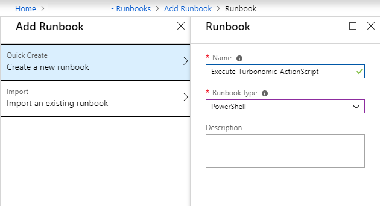
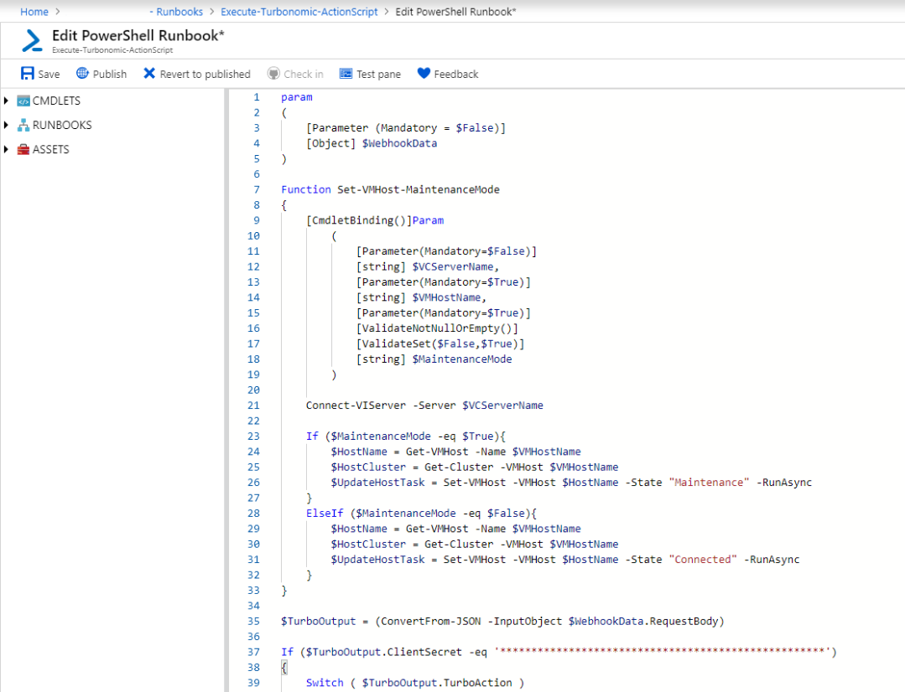
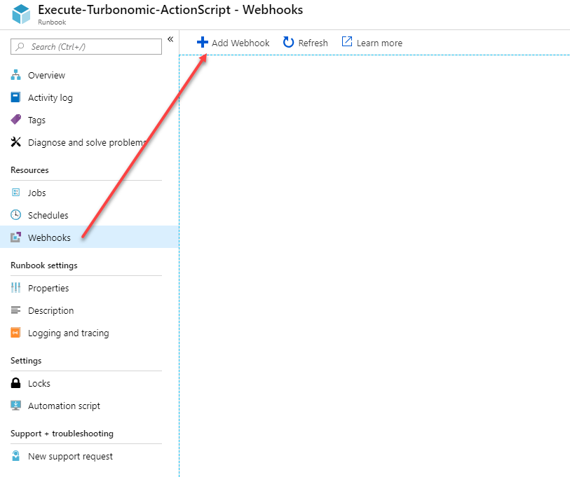
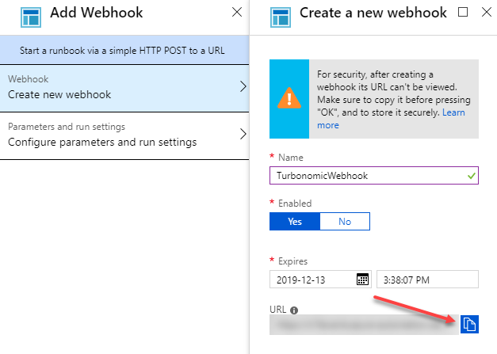
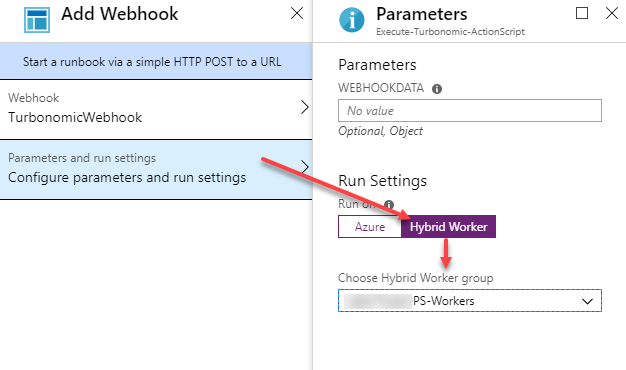
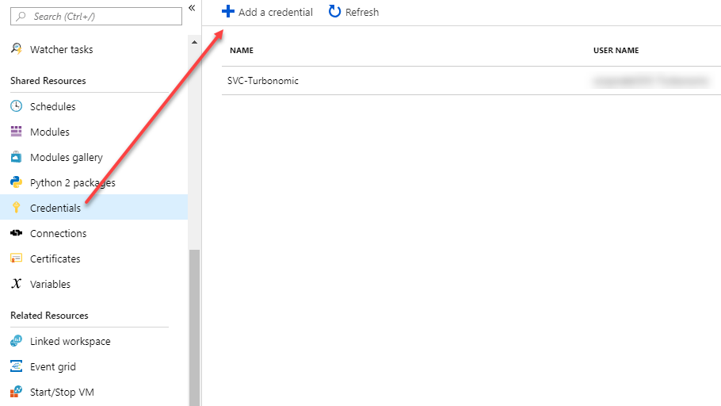
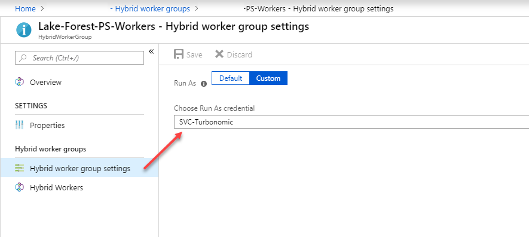
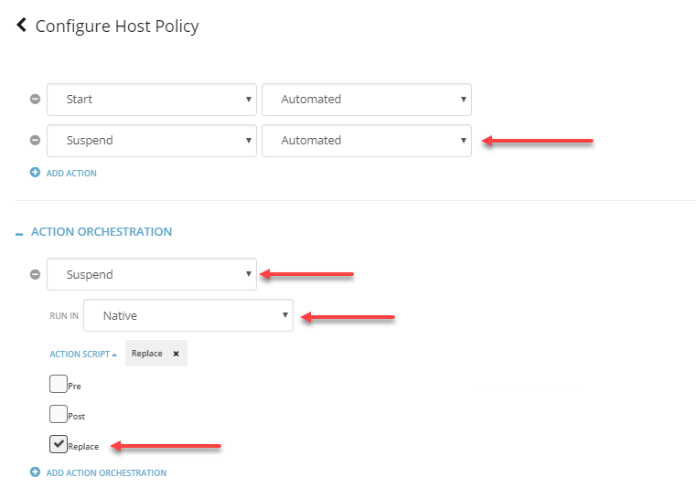

# Background

For certain types of actions with Turbonomic, it would be great if we could run PowerCLI scripts directly from Turbonomic as part of the action, either before or after the action is executed by Turbonomic.  In our scenario, we are using Turbonomic to manage our hosts with a host policy that fully automates 'Start' and 'Suspend' of a host.  This works great, except for one problem: suspending a host in our environment triggers a high priority event to our Hyper-Visor team because the host is no longer responding.  What should be an easy problem to resolve with our monitoring team, i.e. creating an action script to notify BMC Patrol that the host being suspended is in fact OK and to not create a P2 ServiceNow incident, turned out to be very difficult because of the fact that their version of BMC Patrol doesn't support API integration.  So, our options were really limited on what we could do to prevent unnecessary high priority incidents.  Initially, I had thought about writing a bash script to just have Turbonomic call API's to the vCenter and put the host in maintenance mode, as opposed to having it suspended.  However, I struck out again - I couldn't find a way to do this with vCenter API directly, but I did find a way to do it with PowerCLI.  Here I will describe how I use Azure Automation with PowerCLI to accomplish this.  This is a really rare use case, but it might be useful for other functions that PowerCLI is capable of.


# Requirements & Scope

* SSH access to the Turbonomic appliance
* Azure Automation Account
  - You should have an understanding of how Azure Runbooks work
* Windows Server 2012R2 running as a Hybrid Runbook Worker with the following requirements:
  - Windows PowerShell 5.1 or later (download WMF 5.1)
  - .NET Framework 4.6.2 or later
  - Two cores
  - 4 GB of RAM
  - Port 443 (outbound)
  - Azure Hybrid Worker Setup (More information: Setting up Hybrid Runbook Worker)
  - PowerCLI 6.0 or later
* An AD Account that is used by Turbonomic and has access to your vCenter.
* Text editor (VSCode, Notepad++, etc).

# Checklist

* Setup Azure Hybrid Worker
* Create the PowerShell script
* Deploy Azure Hybrid Worker
* Add Azure Runbook which will run PowerCLI
* Create a webhook for the Azure Runbook
* Create a bash script which Turbonomic will execute a CURL command to invoke our Azure webhook.
* SSH to the Turbonomic appliance.
* Copy bash script to the location where it can be ran by Turbonomic
* Configure Turbonomic to run Action Script

# Procedure
## Setup Azure Hybrid Worker

Follow this Microsoft guide on deploying a Azure Hybrid Worker 

## Create the PowerShell Script

This script can also be used for other executions of PowerCLI, and incorporates a switch statement that checks the script name which was passed from Turbonomic.  Example - REPLACE_SUSPEND_PhysicalMachine.sh is passed from Turbonomic as part of the data from the webhookdata.  This variable is then read so that we can execute specific actions for each script that calls it.  The alternative would be to create separate runbooks + webhooks for each action.  I felt this was easier to manage.

```PowerShell
param
(
    [Parameter (Mandatory = $False)]
    [Object] $WebhookData
)
 
Function Set-VMHost-MaintenanceMode
{
    [CmdletBinding()]Param
        (
            [Parameter(Mandatory=$False)]
            [string] $VCServerName,
            [Parameter(Mandatory=$True)]
            [string] $VMHostName,
            [Parameter(Mandatory=$True)]
            [ValidateNotNullOrEmpty()]
            [ValidateSet($False,$True)]
            [string] $MaintenanceMode
        )
 
    Connect-VIServer -Server $VCServerName
 
    If ($MaintenanceMode -eq $True){
        $HostName = Get-VMHost -Name $VMHostName
        $HostCluster = Get-Cluster -VMHost $VMHostName
        $UpdateHostTask = Set-VMHost -VMHost $HostName -State "Maintenance" -RunAsync
    }
    ElseIf ($MaintenanceMode -eq $False){
        $HostName = Get-VMHost -Name $VMHostName
        $HostCluster = Get-Cluster -VMHost $VMHostName
        $UpdateHostTask = Set-VMHost -VMHost $HostName -State "Connected" -RunAsync
    }
}
 
$TurboOutput = (ConvertFrom-JSON -InputObject $WebhookData.RequestBody)
 
If ($TurboOutput.ClientSecret -eq '****************************************************')
{
    Switch ( $TurboOutput.TurboAction )
    {
        PRE_START_PhysicalMachine.sh
        {
            ### Future PowerCLI Action
        }
        POST_START_PhysicalMachine.sh
        {
            ### Future PowerCLI Action
        }
        REPLACE_START_PhysicalMachine.sh
        {
            Set-VMHost-MaintenanceMode -VCServerName "<vCenterServerName>" -VMHostName $TurboOutput.TargetName -MaintenanceMode $False
            Write-Output "Took $TurboOutput.TargetName out of maintenance mode."
        }
        PRE_SUSPEND_PhysicalMachine.sh
        {
            ### Future PowerCLI Action  
        }
        POST_SUSPEND_PhysicalMachine.sh
        {
            ### Future PowerCLI Action  
        }
        REPLACE_SUSPEND_PhysicalMachine.sh
        {
            Set-VMHost-MaintenanceMode -VCServerName "<vCenterServerName>" -VMHostName $TurboOutput.TargetName -MaintenanceMode $True
            Write-Output "Placed $TurboOutput.TargetName in maintenance mode."
        }
    }
}
```


## Create the Webhook in Azure Automation

Once you've written the script, you'll need to create a runbook.  I've named my runbook 'Execute-Turbonomic-ActionScript' and ensured the type of script is PowerShell.



Once the runbook is created, the next step will be to edit and paste the PowerShell script from above:



Once you've saved the runbook, it's time to create a webhook.  To do that, you need to click Webhooks → Add Webhook:



Make sure you copy the webhook URI and store it in a safe and secure place.  If you lose the URL, you'll need to create a new webhook!



Next, we're going to configure the Webhook run settings to run on 'Hybrid Worker', and we'll select the Hybrid Worker Group.



Next we need to add an Active Directory user that has the rights to connect to vCenter with PowerCLI:



We'll then set the Hybrid worker group to use this credential:



Create Turbonomic Action Script

Once you've got the runbook and webhook all setup, you'll need to create a request to invoke it from Turbonomic.  I've built the script so that it sends the necessary data from Turbonomic to our PowerShell webhook.  Because an Azure webhook is opened to anyone who has the URL, I felt it necessary to add another layer of security, and that is to place a field 'ClientSecret' in both my PowerShell script, and my Action Script.  That way, if someone does discover the URL, and they knew the name of a physical host, they couldn't do anything malicious, unless of course they discover our client secret.  There might be a better way to secure this, but for now it's how I'll be doing it.
	
*REPLACE_SUSPEND_PhysicalMachine.sh:*

```bash
#!/bin/bash
curl "https://s15events.azure-automation.net/webhooks?token=**********************************" \
-X POST
-H "Accept: application/json" \
-H "Content-Type:application/json" \
--data @<(cat <<EOF
{
    "ClientSecret"   : "**************************************************************"
    "TurboAction"    : "${0##*/}",
    "TargetUUID"     : "$VMT_TARGET_UUID",
    "TargetInternal" : "$VMT_TARGET_INTERNAL",
    "CurrentInternal": "$VMT_CURRENT_INTERNAL",
    "CurrentName"    : "$VMT_CURRENT_NAME",
    "NewInternal"    : "$VMT_NEW_INTERNAL",
    "NewName"        : "$VMT_NEW_NAME",
    "ActionInternal" : "$VMT_ACTION_INTERNAL",
    "ActionName"     : "$VMT_ACTION_NAME",
    "NewInternal"    : "$VMT_NEW_INTERNAL"
    }
EOF
)
```

This script is the placed on the Turbonomic appliance in the following location: /srv/tomcat/script/control and must be named using the following syntax:

### References

* SE: Applications, VM, VDC, Host Storage, DIsk Array, PhysicalMachine
* Actions: depends on SE (for VMs: Move, Change, Reconfigure, Resize, Provision, Suspend, Start, Terminate)
* Timing: PRE, POST, REPLACE, CLEAR

### How to Implement

* Create an Automation Policy add Action Orchestration, specify an action type to which you can attach an Action Script for the desired scope
* Create a properly named action script file in the correct location on your Turbonomic instance
  - /srv/tomcat/script/control
  - Action script file naming convention
  - \(\(PRE\|POST\|REPLACE)\_\)\<action\>\_\<ServiceEntityType\>.sh

So in this case we created a script named '**REPLACE_SUSPEND_PhysicalMachine.sh**' and placed it in this location: **/srv/tomcat/script/control/REPLACE_SUSPEND_PhysicalMachine.sh**

## Configure Turbonomic to run Action Script

The last step is to configure Turbonomic to run our Action Script in place of the action orchestration:


