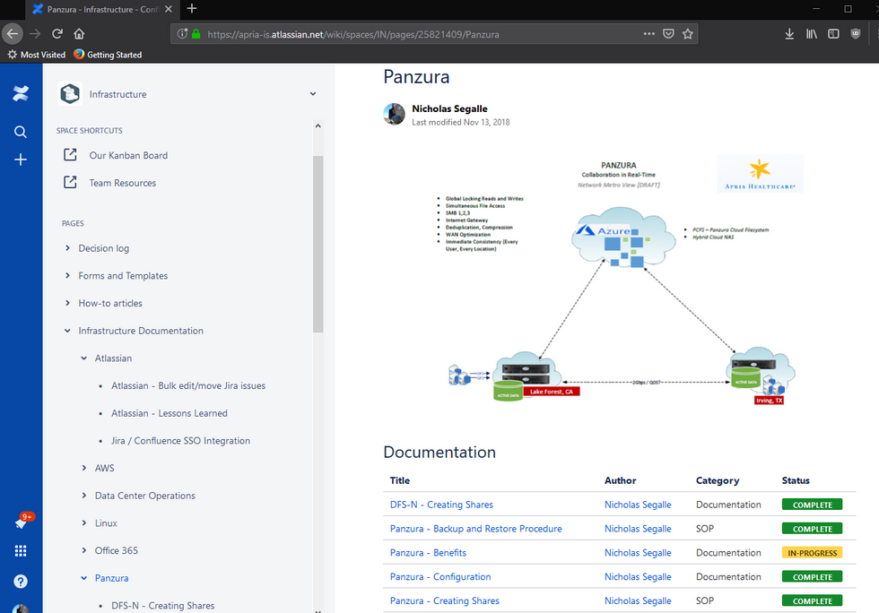

# Jira / Confluence

Apria outsources their IT operations to NTT Data and NTT uses Service Now for their 'Services Operations Manager' or SOM.  I bring this up because not being in IT operations, there really wasn't any workflows for the infrastructure team.  Not that we wanted to be involved with operations, but we needed something to track our progress and collaborate on projects with.  We also needed something for documentation...  well, something other than SharePoint.  I had a few years of experience with Atlassian (Jira/Confluence) from working at Prysm and at Merck KGaA, but when I got to Apria they had just barely purchased a few licenses for Atlassian cloud.  I made it a big point that we needed a place for our documentation and a place to track work/log time.  My suggestion was the infrastructure team needed to adopt Jira for project management and Confluence for our wiki.  It was slow a slow adoption, but now it's all we use.  Confluence makes documenting fun - just look at all the documents I've written this year (117 as of writing this post).

This is an image

Test

2018-12-18-22-30-02.png</img>

2018-12-18-22-31-19.png</img>

