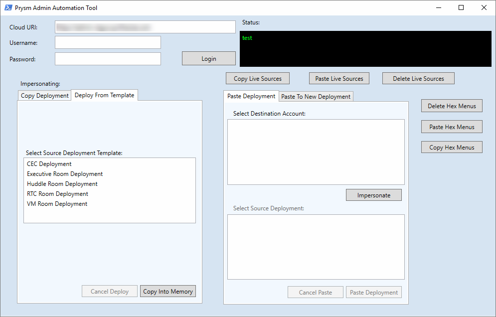

# Overview

2018 was a very productive year for me.  I had started 2018 with uncertainty regarding my job at Prysm because of the notice of the WARN act that was given to all employees at the end of 2017.  Prysm was having a issues securing funding, and this resulted in a lot of my colleagues leaving Prysm, including my former manager, Gerald Pascua, who is now working for NTT Data on the Apria account.  I was fortunate enough to secure a position working directly with Apria at the end of January 2018 as an Infrastructure Technical Lead.  Joining Apria also meant that I was required to be in the office every day, which was not a big issue for me except that Apria was a 140-mile roundtrip journey from my home in Temecula.  This was not something I was comfortable with, and it was the catalyst for me moving my family to the Lake Forest/Irvine area.  

# Prysm PowerShell Automation

At Prysm, we had a need to automate the creation of deployments, which was a very time consuming process for the Tier 1 / Tier 2 staff.  The process involved logging into an administrative website and manually creating the deployments and then manually configuring the deployment.  This whole process would take 45 minutes to an hour for each deployment, and because there were dozens of screens you had to click through, it often meant that there were steps missed and miss-configurations being deployed.  I initially started looking at how to automate web calls using PowerShell, but felt that having a slew of PowerShell functions that needed to be run would be a burden to the Tier 1/2 staff.  They really needed a console where they could just click the type of deployment and choose what account to deploy it to.  What I came up with was a PowerShell form built completely in PowerShell with a little help with Visual Studio to build the form in XAML.

<br>

<center></center><center><i>Admin form created using XAML and PowerShell</i></center>

<br>

# Jira / Confluence

Apria outsources their IT operations to NTT Data and NTT uses Service Now for their 'Services Operations Manager' or SOM.  I bring this up because not being in IT operations, there really wasn't any workflows for the infrastructure team.  Not that we wanted to be involved with operations, but we needed a tool to track our progress and collaborate on projects together.  We also needed something for documentation...  Well, something (anything) other than SharePoint.  I had a few years of experience with Atlassian (Jira/Confluence) from working at Prysm and at Merck KGaA, but when I got to Apria, they had only purchased a few licenses for Atlassian cloud and had zero implementation.  I made it a big point that we needed a place for our documentation and a place to track work/log time.  My suggestion was the infrastructure team needed to adopt Jira for project management and Confluence for our wiki.  It was slow a slow adoption, but now it's all we use.  Confluence makes documenting fun - I've written over 120 documents and how-to guides this year.

<br>

<center></center><center><i>Infrastructure team space and documentation hierarchy</i></center>

<br>

When we first adopted Atlassian we essentially had a blank slate for our projects and documentation.  We've created around a dozen Wiki spaces and a handful of Jira projects, and are tracking our time with Jira on all the tasks and issues we're working on.  I also created custom workflows in Jira for our team, including custom reports.  Our framework in Jira has helped other teams to adopt best practices and the usage of Kanban boards really helps visualize our work.

<br>

<center></center><center><i>Jira - Kanban board we created with custom workflow and a dozen different issue types</i></center>

<br>

# Panzura NAS Replacement

The project portion of the Panzura migration was handled by Mark Hamel, and the technical aspect of moving all the data from our aging NetApp filer was led by myself.  This wasn't the first time I have been involved with very large data migrations, and not the first time I've done it for Apria.  In 2015 we had to split all the unstructured data from the NetApp so that only data owned by CVS Healthcare could be moved to a new filer (CVS had aquired a portion of Apria's business - Coram).  Once that process of splitting the data was complete, CVS had requirements of correcting permissions issues - you know, removing the 'Everyone' group and replacing it with 'Domain Users'.  This was done via PowerShell and Batch files, but mostly Batch files because of the speed of the command processing when compared to PowerShell. 

Since coming back to Apria as a full-time employee I was an obvious choice for leading the technical aspects of this project, but initially my role was to be hands-off and strictly architectural, that is because we paid an outsourced operations team to do this work.  After a little back and forth with the potential candidates to lead the technical aspect of the project, I asked my manager to just put me on as the technical lead and let me script it out with PowerShell, and I guaranteed we wouldn't have an issue because of a lack of planning and executing.  What resulted from this project was some synchronization scripts that I wrote in PowerShell that made it possible to perform a final sync of 75 million files (78.04TB) in less than 4 hours.  During the initial replication phase I had also written PowerShell scripts to output a nice HTML table and email to management:

<br>

<center></center><center><i>Sample report for data migration status</i></center>

<br>

To build the report, I had to scan the Panzura filer each morning after the sync jobs finished for the night.  The NetApp was only scanned once a week in order to keep the load light, because just analyzing the filer was fairly CPU intensive.  Using PowerShell and EMCopy (EMC Copy Utility), I was able to scan the entire filer in less than 3 hours.  Once I had the data, I was then able to pump the results into a Grafana dashboard using PowerShell and InfluxDB which I thought was equally as effective as a daily report.

<br>

<center></center><center><i>Copy progress dashboard</i></center>

<br>

All in all, the project went smoothly.  We didn't have any missed data after the cut over, and because of the tight system integration points to the NetApp and a lot of key systems (AS/400, AIX, ECM, BPM), we came up with a very thorough and comprehensive cut over and back out plan.  NTT's service management was so impressed with our cut over plan, they decided to use the document as a template and made it an example of how large impacting changes should be done.  It was a nice little kudos from our operations team.

# Legacy Data Center Optimizations

## VMware

This year I was reunited with the vCenter I had cared for previously.  The Apria vCenter was truly one of my best works, I had the virtual environment running optimally.  Now?  It hurts to login and see the chaos...  After I left, it seems like my counterparts just stopped caring, and it's painfully obvious.  Since my return, I am always stumbling upon things that make me cringe, and I'm constantly making suggestions to improve performance and operability.  Some highlights include the power settings on all the new HPE blades.  They were all set to power save mode, and after I pointed it out to the team and they fixed it, we saw 10 - 15% more CPU utilization, and CPU latency went from 30% to <2%.

<br>

<center></center><center><i>CPU Latency of all the VMs before my suggestions (left of red line) and the results after (right of red line).</i></center>

<br>

Other issues with VMware include not patching ESXi, creating snapshots and forgetting about them (crtically large snapshots were identified), never updating VM Tools or VM Hardware, and never updating firmware.  Because I'm not in operations, my role in remediation is just directing teams to fix the issues and offering technical guidance.  NTT is bringing a new team to manage the VMware environment, so I'm hopeful I will only be needed for architectural decisions and not needed for troubleshooting issues. 

## Nutanix / SQL

One of Apria's largest database servers runs on SQL 2012 on Server 2008R2.  This VM is a very large VM - 896GB of RAM and 20 vCPUs.  The Nutanix node it sits on has 1TB of memory and has 2 x 14 core Xeon processor.  With these types of specs, it would be expected that the VM would perform great, but unfortunately that isn't the case.  The real bottleneck for this VM isn't the compute, but rather the underlying storage.  To understand better why this is a problem, we'd have to look at the workloads this SQL server is under.  The server is essentially half a data warehouse, and the other half is transactional data.  This causes a tremendous amount of disk latency because literally half the work load is sequential/random reads and the other half is very write intensive.  Also, worth noting is that the SQL databases are 17TB in size, and these Nutanix nodes only have around 7TB of SSD caching per node.  Now, Nutanix does a great job of servicing hot/cold data tiers, but when your database footprint is this large, the Nutanix Controller VMs must work harder to support this much data.  The CVM does this by using SSD caching on other nodes, and then Local HDD where it sees fit.  This comes at a price though, and the price is disk latency.  It also means the CVM for this Nutanix node is running at 100% CPU a lot of the time. 

After researching it and looking at Josh Odger's suggestions for disk latency on Nutanix nodes, we discovered that the Range Cache Hit % was terrible:

<br>

<center></center><center><i>Stargate statistics showing Range Cache Hit%</i></center>

<br>

This was likely due to the memory of the CVM being exhausted.  My suggestion was to take the CVM and increase both the vCPU to 12, and the RAM to 128GB.  The operations team ended up going to 96GB, and there was a noticeable difference:

<br>

<center></center><center><i>Latency is reduced marginally, but there is plenty of room for improvement</i></center>

<br>

It was better, but unfortunately the vCPU for the CVM was increased (12 vCPU) and the SQL server vCPU stayed the same (20 vCPU).  This results in an over subscription of resources, and the CPU ready has now started to go up:

<br>

<center></center><center><i>CPU % Ready has gone up due to the over subscription of resources</i></center>

<br>

My suggestion to fix this issue is to drop the SQL server down to 16 vCPU and leave the CVM at 12 vCPU.  This should result in much better performance overall, and couple that with adding more RAM to the CVM (going from 96GB to 128GB), we should be as optimal as we can be without adding more resources.  The next suggestion is to add more SSD drives to the host(s) so that the gigantic VM can utilize more SSD caching.

<br>

## Citrix
### Citrix Managed Services (CMS)
The Citrix environment at Apria is large. It handles approx. 3,200 users per day and is a large portion of the Intel infrastructure.  Citrix takes 2 entire blade chassis of HP Gen 9 blades (32 blades).  It's availability is critical for Apria's business, and we're continuing to add partners all the time, with another 1,000 users projected by end of the first quarter 2019.  There has been a long history of miss-management of our Citrix environment, and it was decided early this year that we would investigate other managed service providers, and one of the best MSPs for Citrix happens to be Citrix Managed Services.  During the vetting process, I went to Puerto Rico to visit their center of excellence.  The leader of the group, Emilio Fuentes, was very welcoming, and what they had to offer was above and beyond what we were expecting.

<br>

<center></center><center><i>Hard at work in Puerto Rico</i></center>

<br>

### On-boarding CMS
The on-boarding process just kicked off in early December, and now we're in the transitional phase. 

### Citrix Licensing
One thing that we wanted visibility into in our environment was licensing usage.  Running out of licenses ranks up there with letting certificates expire, it's an easy thing to fix and be proactive on, but once you run out or let them expire, being reactive can cause a major outage.  The result of that was I wrote a few PowerShell scripts that check the license usage every 10 minutes and reports it directly to Grafana.  It also grabs worker server status and partner usage statistics and is displayed on our infrastructure dashboards.

<br>

<center></center><center><i>This is our Citrix environment, tracking the partner logins and worker server status.</i></center>

<br>

# Information Radiator

<center></center><center><i>How the PowerShell server feeds data to Grafana</i></center>

The idea behind the information radiator came from our manager, and it was an idea that I became really passionate about.  The idea was to be able to see correlating telemetry data from all our major systems, as well seeing incidents and changes in the environment as annotations to the telemetry data, so we can speed up the identification and resolution with major production outages.  Besides that, who doesn't love a good dashboard?  Making our work visible was a key component to this year at Apria.  An example of telemetry + incident/change data is when the network team fixed a broadcast storm coming from the Unix environment, and it was clear that this had effects across the entire environment to all networked devices:

<br>

<center></center><center><i>This is the network bandwidth for all the VMware environment.  As you can see, traffic was cut by 2/3rds after the fix</i></center>

<br>

Now, there are all kinds of tools that can do this out of the box, to a degree, but none have all the integration points that I was after.  I wanted to be able to take a data set and visualize it, but I also needed to make sure the data was dynamic and useful.  Since I love working with databases, SQL reporting, and dashboards, I was nominated to be the one to choose the tool, build it out and operationalize it.  I had narrowed it down to 2 choices, Kibana and Grafana.  I had used Kibana with an ELK stack for many years, and have a lot of good experience with it, but as I was struggling to find a way to aggregate this type of data in an easy way using an ELK stack.  That's when I discovered Grafana.  Grafana is dashboards. Dashboards are composed of individual Panels arranged on a grid. Grafana ships with a variety of Panels. Grafana makes it easy to construct the right queries and customize the display properties so that you can create the perfect Dashboard for our need.  My first data source was InfluxDB, which is a time series database, and then wrote PowerShell modules to add data via the REST-API's:

<br>

```PowerShell
Write-InfluxDB -Measure WebServer -Tags @{Server='Host01'} -Metrics @{CPU=100; Memory=50} -Database Web -Server influxdb.apria.com
```
<br>

The next addition was to add GraphiteDB (Carbon Cache + GraphiteWeb) which is also a time series database.  I chose this because of a set of scripts I found for pulling telemetry data from vCenter, which was done by the team over at sexibytes.  This took care of the VMware environment, but I still needed to get data from ServiceNow, and other data sources.

<br>

<center></center><center><i>This is our Panzura Cloud Filer dashboard I created.  It uses SNMP data collecting and sent to InfluxDB</i></center>

<br>

<center></center><center><i>Created a view into the Azure Storage account</i></center>

## ServiceNow
NTT Data manages the instance of ServiceNow that is used by IT Operations.  The idea behind putting it into Grafana is that we want to be able to see issues/alerts/incidents/changes with configured items and have that as an overlay to telemetry data in Grafana.  So, in theory, if we see a random spike in CPU for a critical VM, we can correlate it to incidents or changes that have taken place throughout the environment. 

Ideally, we would use API integration to pull this data directly from ServiceNow, but because we are unable to get this level of access, we had do it via other methods.  The method that we're using to accomplish this to connect to the NTT data warehouse via REST API methods using PowerShell.  At a high level, the data is first queried by Incidents or Changes, this returns a QueryID that can be used to check the status of the query, and if it's successful, we can then pull the data as an XML table and transform it into something that can then be sent to InfluxDB which is running on the Grafana server.

<br>

<center></center><center><i>Incident graph using ServiceNow data</i></center>

<br>

<center></center><center><i>Incidents by time using ServiceNow data</i></center>

<br>

<center></center><center><i>Changes scheduled for the current day using ServiceNow data</i></center>

<br>

# PowerShell Automation
## TeamCity

TeamCity is a server-based Web application that allows Java and .NET development teams to continuously integrate changes to the code base, frequently run distributed builds and tests, check and improve code quality, all the while making efficient progress toward successful project completion. TeamCity includes many productivity plugins for IntelliJ IDEA, Microsoft Visual Studio and Eclipse, which improves team collaboration without breaking the established practices, by separating creative work from routine tasks.

With TeamCity, we're able to schedule PowerShell scripts to run as 'builds', and this is hooked into Github, so if we make changes to our scripts and commit those changes, the build process of TeamCity automatically picks up the changes and runs the new changes.

<br>

<center></center><center><i>TeamCity build queue</i></center>

<br>

<center></center><center><i>TeamCity / Github integration for the Infrastructure team</i></center>

<br>

## Turbonomic

Turbonomic is a workload automation tool that was purchased by Apria late last year, just before I came onboard.  The project was handed to me as one of my first projects, and overall the implementation and training went very well. We put it into our production environment and started immediately using it for workload migrations (DRS).  We saw an increase in VM efficiency, but its real strength is assisting in VM right sizing.  Like every environment, VMs are over provisioned and there is a lot of wasted resources, and Apria's environment was no different.  The challenge of course is getting the applications teams to buy into having us right size the VMs.  We're still working on that, but one of the items we had to do to prove Turbonomic's worth was to recover one chassis of blades from the entire environment.  I felt this exercise was one of futility, but nevertheless we had to show that Turbonomic could suspend hosts in our environment all while maintaining the same level of performance as before.  The challenge was easy, and we were able to suspend 12 hosts and we proved that it was just as efficient as before.  However, one of the outcomes of suspending all those hosts was our Wintel team started receiving high priority alerts because the hosts were no longer responding.  Initially we asked the monitoring team to help with our problem, but they said there were no possibility of integration, and rather than challenge their response, I decided to take it a different route and see if I could come up with something using the scripting ability of Turbonomic, known as 'Action Scripts', which is nothing more than a specifically named Bash file.  My idea was to just put the hosts in maintenance mode instead of suspending them, since they'd be online but 'not used'.  Initially I thought I'd just right a bash script to do a CURL command to the vCenter API's, but after a bit of research I determined that the API's don't support putting a host in maintenance mode.  Instead, I came up with this idea - Using PowerCLI with Turbonomic and was able to right a web hook in Azure Automation to execute a PowerShell script on-premise just by accepting a CURL command from Turbonomic.  It's a round about use case, but I also published it on the Green Circle website in case the idea can help someone else.

